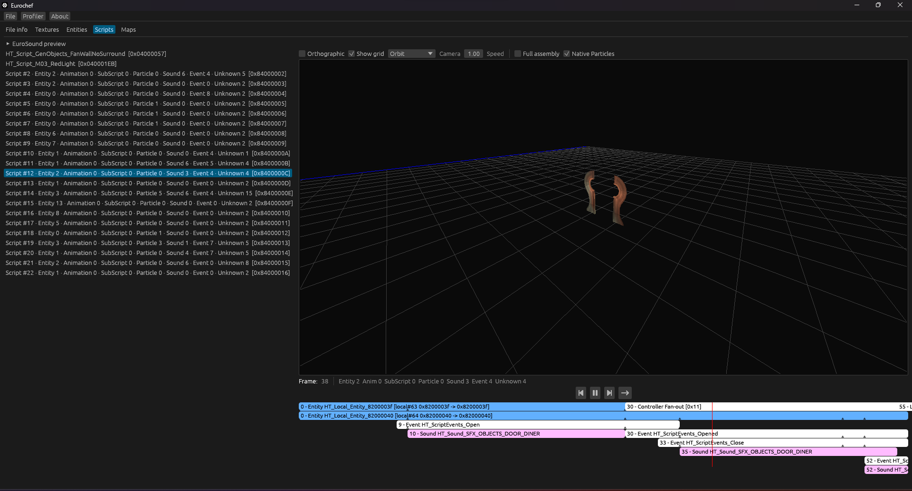
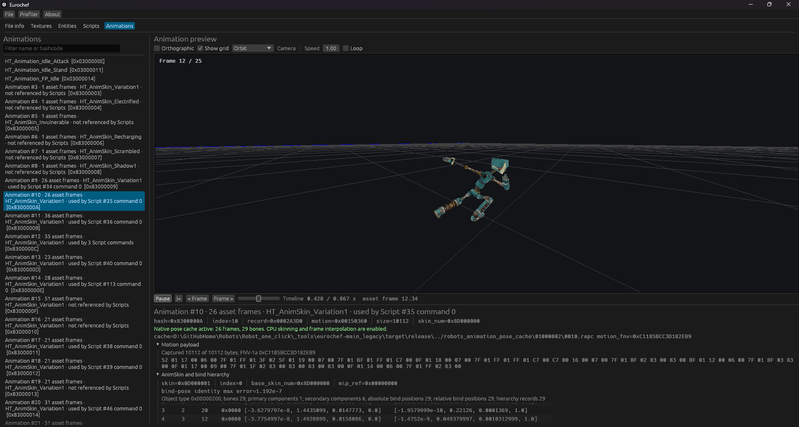
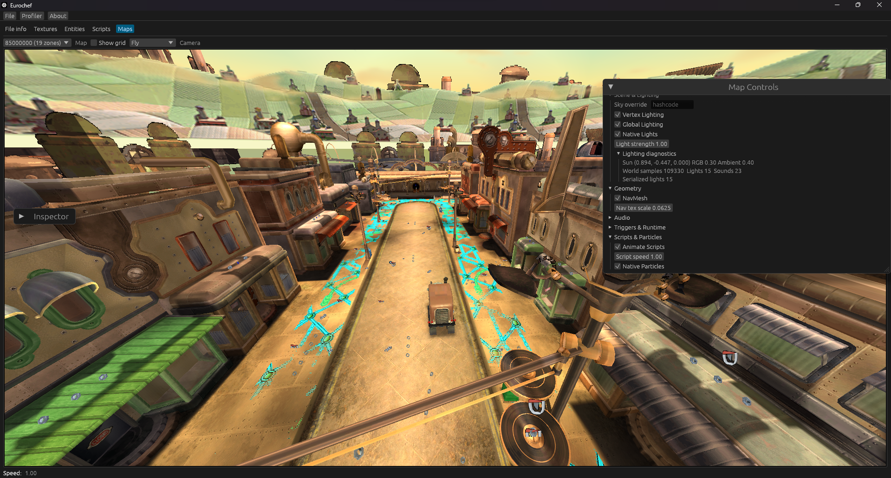

# 👨‍🍳 Eurochef

_Cooking up some EDBs_

> **Robots fork.** This is the maintained PC fork of
> [eurotools/eurochef](https://github.com/eurotools/eurochef), focused on
> *Robots* (EDB version 248).

Eurochef provides tools and Rust crates for working with Eurocom EngineX(T)
files; including filelist, `.edb`, `.sfx` and `.elx` files.

See [docs/CLI_FAQ.md](docs/CLI_FAQ.md) for supported CLI commands and common
Robots workflows.

  
  
  

  <b>Maps</b> — native lighting & particles &nbsp;•&nbsp; <b>Scripts</b> — AnimScript/Sound timeline &nbsp;•&nbsp; <b>Animations</b> — native skeletal playback

## Features

* [x] Easy to use CLI Tool
* [x] Texture extractor
  * Supported output formats: png, qoi, tga
* [x] Entity extractor
* [x] Map extractor
  * [x] Blender plugin
* [x] Filelist re-packer
* [x] GUI viewer tool
  * [x] Native Robots map runtime (triggers, scripts, entities, vehicles)
  * [x] Native Robots particle renderer (`EXParticleSys`)
  * [x] Native MapZone lighting + apparent-sun global lighting
  * [x] Native PC MUSX sound preview, mixer and persistent cache
  * [x] Native skeletal animation playback (full-bone, CPU skinning)
  * [x] Native Script Animation/Sound timeline playback
  * [x] Trigger diagnostics, path-context visualization and mouse picking
* [ ] Filelist VFS
* [ ] Intermediate representation of EDB files
* [ ] EDB to Euroland 4 decompiler
* [ ] And more?

## Robots PC additions

This fork keeps the upstream Rust workspace and adds evidence-backed, reverse
engineered support for the PC release of *Robots*. Every feature below is
tied to instruction-level proof against the verified executable
`Robots.exe` (`SHA-256 8fefaa09767d9d1e76ca8c023e4e60720808cc529fc3abe1ff6d863d93f668bc`)
and validated against the full shipped 179-EDB corpus wherever practical.
Serialized EDB decoding itself does not depend on executable addresses.

### 🗺️ Maps, triggers, scripts & entities

* Maps are split into logical modules: native trigger behavior, specialised
  entity resolution and script behavior live in their own modules instead of
  one large map frame.
* AnimScript composition resolves local entities, external script
  dependencies, recursive `SubScript` and serialized timing. Cyclic
  `SubScript` branches are skipped without aborting the parent script.
* Controller slot tables are resolved directly from serialized command
  indices — never `thread_controller_count` or an assumed `index - 1` — so
  composite objects (vehicles, mechanisms, characters) keep every part.
* Every raw `AnimScript` opcode is now classified by native role: Controller
  Init, Dynamic Light, Camera, External Callback, Collision, Force Feedback,
  Loop, Controller Fan-out and Terminator. Payload lanes for the Dynamic
  Light, Camera and Collision commands are decoded from the exact native
  consumer, while every raw byte is preserved for provenance.
* Native `XTrigger_Platform`, `XTrigger_Lift` and `XTrigger_Vehicle` motion is
  reproduced from serialized path/speed/acceleration data: exact map speed,
  fixed-60 Hz acceleration ramp, ping-pong/loop behavior, tangent-based
  Vehicle steering yaw, and a manual/automatic `Native Event Gate`
  (`0x100 Start` / `0x200 Stop`, Platform retrigger reverse, automatic
  path-node opcode `4`/`8` delivery).
* Vehicle assemblies resolve body and wheel components through the original
  controller slots; road wheels roll and both drive/passive wheels steer
  using the exact native heading-delta/smoothing formula.
* Path-context is recovered (without inventing traversal) for Camera, Camera
  Marker, Watchbot, BossRatchet, Monster Transporter and Monster; a false
  BossSewer path match was instruction-proven and explicitly rejected.
* NPC (mission/tutorial/cutscene context) and Monster/Test/Fish
  (proximity/path/flag context) native trigger getters are recovered and
  shown as diagnostics.
* `XItemPhysics_Platform` native contact-carry (linear velocity transfer) is
  reproduced for Platform/Lift/Vehicle; full contact-point/manifold physics
  remains a separate task.
* A `146`-class runtime census (`XItemHandler*`, `XItemPhysics*`,
  `EXItemAnimator*`, `EXItemRender*`) with exact descriptors/vtables/xrefs
  drives ongoing behavior recovery; `XItemPhysicsSphere` and PlayerBall
  slippery/electric/slime surface reactions are instruction-proven.
* Trigger mouse picking uses a reusable, cleared, isolated-state RGBA8
  pick framebuffer.
* NavMesh (`0x606`/`0x607`) geometry is preserved and independently
  toggleable with a world-space UV scale.

### 💡 Lighting

* `EXGeoLight` MapZone lighting reproduces the exact native `ltype` feature
  mask, range/cone falloff and the true `byte/128` RGB scale (not `/255`).
* A separate `Global Lighting` stage reproduces the apparent outdoor sun:
  15 known level-UID coefficient tables, three live smoothed directional
  slots, spatial per-position world-light sampling from MapZone vertex
  colours, and the executable fallback for unmapped positions.
* `Vertex Lighting` toggles the full contribution without rebuilding map
  geometry.

### ✨ Particles

* Native `EXParticleSys` is fully reproduced: fixed-step (`1/60` or `1/30`)
  simulation, emission rate, pool limits, lifetime, box emitter, velocity
  distribution, damping/acceleration, material/blend selection and the
  appended curve table (rotation, scale, RGBA, speed-offset, initial age).
* Validated against the full shipped corpus: 179/179 EDB, 321 particle
  systems, 10,804 curve records, 0 out-of-range material selectors.
* Remaining boundary: deterministic per-emitter preview seeding vs. the
  game's shared global RNG schedule.

### 🔊 Sound

* The GUI decodes PC MUSX data in-process through a native Eurocom IMA
  ADPCM decoder: soundbank waves, streams, music and SubSfx dependencies.
  No external `.NET EuroSoundBridge` process is required at runtime for
  playback (a thin headless `.NET 8` bridge is used only to source the
  original bank-parsing logic).
* Playable map and external-script sound references are preloaded into a
  persistent, worker-backed WAV cache when an EDB is opened.
* Maps automatically plays ambient `EXGeoMapZone` sounds from the fly camera
  listener with volume/radius attenuation, panning and fades.
* Scripts automatically plays native `Sound` commands on the AnimScript
  timeline, including nested `SubScript`, seeking and looping.
* Validated on the real game corpus: 13 soundbanks, 2487 SFX, 4218
  sample-pool entries, 3057 waves, 0 failures.

### 🎬 Animation

* Full native skeletal playback: complete active-bone decoding, hierarchy,
  bind poses, serialized one-to-four bone weights, position/quaternion
  interpolation and CPU skinning, driven by a reproducible offline pose
  cache built from the verified executable.
* `Animation.skin_num == AnimSkinHeader.base_skin_num` is the proven
  Animation-to-AnimSkin binding rule (not an array index); `0xFFFFFFFF` is
  the explicit no-skin / "use the asset's own bound skin" sentinel.
* Full corpus binding census: 179/179 EDB, 1744 Animation records, 234
  AnimSkin records, 1390 exact bindings, 354 no-skin sentinels, 0 unresolved.
* A dedicated `Animations` tab exposes searchable clips, timeline scrub,
  Play/Pause/Loop/Speed, frame stepping and full diagnostic metadata.
* `Scripts` plays native Animation commands on the real AnimScript timeline
  (including nested `SubScript` and the implicit-skin sentinel), as seen
  in the Scripts preview above.

### 🧩 Other

* `Global Lighting` (see above) bakes static world lighting to a GPU texture
  per map, avoiding a full triangle scan and CPU lighting clone every frame.
* `XTrigger_Script` creation flags, trigger provenance and known
  effect-created Script XItems are exported as structured forensic data.

## Current status

### ✅ Working

* Robots PC EDB textures, entities, maps, scripts and vehicle assemblies.
* Native map rendering: trigger/entity/script composition, GPU global
  lighting, MapZone lighting, NavMesh and mouse-pick trigger selection.
* Native `EXParticleSys` particle rendering (see boundary note above).
* Native PC MUSX decoding, mixing and preview for soundbanks, streams,
  music and SubSfx, including automatic Map ambience and Script playback.
* Full native AnimSkin skeletal playback (hierarchy, weights, interpolation,
  CPU skinning) for the proven Animation-to-AnimSkin binding set, in both
  the standalone `Animations` tab and `Scripts` timeline playback.
* Native Platform/Lift/Vehicle path motion, event gating and contact carry;
  Camera/Camera Marker/Watchbot/BossRatchet/Transporter/Monster/NPC path and
  trigger-context diagnostics.
* CLI extraction, reports and Filelist v7 operations listed in
  [CLI FAQ](docs/CLI_FAQ.md), including `edb trigger-report`,
  `edb script-health`, `edb entity-report` and `edb anim-binding-report`.

### 🚧 Work in progress

* Animation records outside the proven Animation-to-AnimSkin binding set
  (`354` sentinel + a small residual) remain on the diagnostic (non-deforming)
  path; cross-clip blending, layered controller state, exact root-motion
  ownership and runtime event coupling are not yet implemented.
* Physics/collision response beyond linear contact carry — real contact
  point, manifolds, impulses, friction and damage handoff — is not yet
  reproduced.
* The majority of `XItemHandler` gameplay subclasses (Monster AI/combat,
  Player/input, Projectile damage, class-specific boss/interactive state
  machines) remain unresolved beyond structural descriptors and path/trigger
  context diagnostics.
* Native Camera activation, player-state/interpolation, portals/load
  transitions, placement groups and zone fog/camera/effect settings are not
  yet simulated.
* Map sound trigger mixing and scripted map sound behavior need broader
  real-map validation beyond the current gates.
* The GUI remains a work in progress; not every EngineX trigger, entity,
  script or platform has a native runtime implementation.

## Support Matrix

### Robots (EDB version 248)

| Textures [1] | Maps | Scripts | Entities | Animations [2] | Sounds [3] | Particles [4] | Spreadsheets |
| :----------------------: | :--: | :-----: | :------: | :-------------------------: | :----------------------: | :-------------------------: | :-----------: |
| ✅/❌                     | ✅/❌  | ✅/❌     | ✅/❌      | ✅/❌                        | ✅/❌                    | ✅/❌                        | ✅/❌           |

[1] Texture/entity support indicates the ability to read headers
and frame data.

[2] Native animation support covers the proven
Animation-to-AnimSkin binding set (`1390/1744` shipped clips) with full-bone
decode, interpolation and CPU skinning. Unbound clips remain diagnostic.

[3] Native sound support covers PC MUSX decoding, mixing and
persistent cache generation for soundbanks, streams, music and SubSfx, plus
automatic Map ambience and Script timeline playback.

[4] Native `EXParticleSys` rendering covers timing, emission,
lifetime, materials and curve channels; individual particle placement uses a
deterministic per-emitter seed rather than the game's shared RNG schedule.

_Each field is formatted as R/W. For example, if a feature can be read but not
written, the field is shown as ✅/❌._

### PC platform

| Platform | Endian | Textures | Sounds [1] | Mesh | Support status |
| :------: | :----: | :------: | :---------------------: | :--: | :-------------: |
| PC       | LE     | ✅/❌      | ✅/❌                    | ✅/❌ | ✅             |

[1] Sound support is currently specific to the PC release of
*Robots* and the GUI preview/cache path.

### Filelists

| Game   | Version | Read | Write |
| :----- | :-----: | :--: | :---: |
| Robots | v7      | ✅    | ✅     |

<!-- ## Map extracting -->
<!-- TODO(cohae): Write this out into a guide on how to build/use CLI/GUI, not just for maps but also everything else -->
